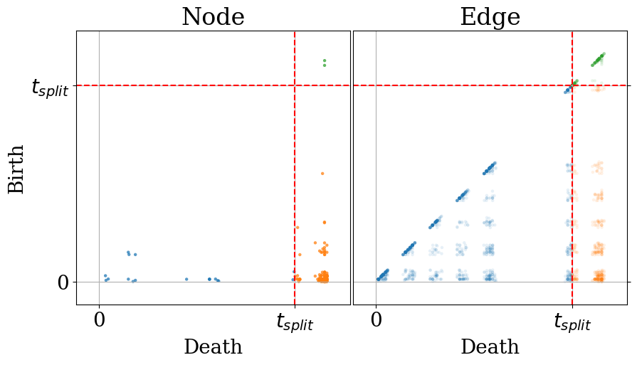

# Code for the paper "Exploring the Performance of Continuous-Time Dynamic Link Prediction Algorithms"

The code used to generate the plots in the paper is available in the `example` folder as jupyter notebook.

# Getting Started

## Create a virtual environment
```bash
python3 -m venv venv
source venv/bin/activate
```

## Install the requirements
```bash
pip install -r requirements.txt
```

For any questions, please contact raphael.romero@ugent.be. 
